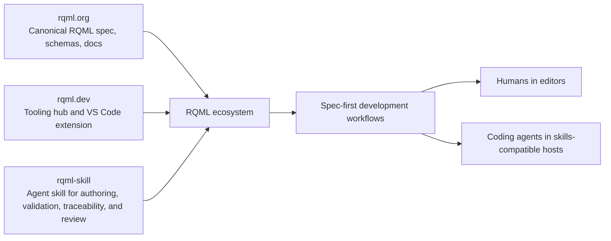

# RQML Agent Skill

The **RQML Agent Skill** is the agent-facing companion to the wider RQML ecosystem.

It gives coding agents a practical, low-friction way to work with **RQML (Requirements Markup Language)**: a structured XML format for writing software requirements with explicit traceability from goals and scenarios to requirements, verification, and implementation.

This repository packages that capability as an **Agent Skill** so tools such as Claude Code, OpenAI Codex, Cursor, GitHub Copilot, Gemini CLI, and other skills-compatible hosts can more reliably:

- author and edit `.rqml` requirements documents
- validate RQML files against bundled schemas
- lint requirements for semantic quality and traceability policy
- inspect and resolve trace links
- extract requirement data for downstream tooling
- generate traceability views for reviews and pull requests

## Where this project fits in the RQML ecosystem

The RQML ecosystem has a few distinct parts:

- **[rqml.org](https://rqml.org/)** — the canonical home of the RQML language, schema, and documentation
- **[rqml.dev](https://rqml.dev/)** — the broader tooling and developer experience surface around RQML, including the VS Code extension and related tools
- **`rqml-skill`** — this repository, which brings RQML into agent workflows through the Agent Skills model

In other words:

- **rqml.org defines the specification**
- **rqml.dev helps humans use RQML effectively in tools such as VS Code**
- **rqml-skill helps coding agents understand, generate, review, and validate RQML artifacts as part of day-to-day software delivery**

That positioning matters because this project is not trying to replace the RQML specification or the VS Code experience. Instead, it connects them to agentic development workflows.



## Why the skill exists

RQML is especially valuable in workflows where requirements are the primary artifact and implementation must remain traceable to intent. That makes it a strong fit for AI-assisted and agentic software engineering.

But an agent only benefits from RQML if it can do more than read XML. It needs help with:

- recognizing when a task is really about requirements engineering
- understanding the expected RQML structure and conventions
- validating files against the right schema version
- enforcing traceability and quality expectations
- producing outputs that fit real engineering workflows

This skill exists to provide that bridge.

It packages concise activation guidance in `SKILL.md`, deeper reference material under `references/`, and executable scripts under `scripts/` so an agent can move from vague “edit this requirements spec” behavior to a more disciplined **spec → design → plan → code → verify** workflow.

## Relationship to the RQML VS Code extension

The **RQML VS Code extension** at **rqml.dev** is aimed at improving the interactive editor experience for people working directly with RQML in VS Code.

This skill complements that extension rather than overlapping with it:

- the **VS Code extension** improves the human authoring environment
- the **Agent Skill** improves the coding-agent behavior and workflow discipline

Together, they support a stronger spec-first loop:

1. A developer works on RQML in VS Code with editor support
2. A coding agent uses this skill to interpret, validate, transform, and reason about the same specification
3. The resulting implementation and verification artifacts stay better aligned with the requirements source of truth

## Core capabilities in this repository

This repository is intentionally lightweight and portable. It is designed to work immediately after clone in common agent runtimes, with no build step.

### Agent activation

`SKILL.md` provides front-loaded trigger phrases and concise operating guidance so compatible agents can discover and activate the skill when a task involves:

- RQML
- `.rqml` files
- requirements specifications
- traceability
- validation and requirements review

### Offline-safe schema validation

The skill bundles supported RQML XSD versions under `references/schemas/` and exposes validation through `scripts/validate.py`.

Key properties:

- auto-detects `rqml@version`
- supports `--schema-version` override
- uses a backend fallback chain: `xmllint → lxml → xmlschema`
- works offline for bundled schema versions
- can emit structured JSON output for downstream tools

### Semantic lint and traceability checks

The repository includes tools that go beyond basic XML validity:

- `scripts/lint.py` for strictness-aware semantic linting
- `scripts/check_traces.py` for resolving non-local trace targets
- `scripts/id_audit.py` for identifier hygiene and change auditing
- `scripts/matrix.py` for Markdown traceability matrices
- `scripts/extract.py` for machine-readable requirement extraction

These tools help agents and developers answer practical questions such as:

- Is this requirements file structurally valid?
- Are acceptance criteria present?
- Are trace edges complete enough for the project’s strictness level?
- Did identifiers drift between revisions?
- What goals, scenarios, and tests are connected to each requirement?

## Who this is for

This project is useful if you are:

- building software in a **spec-first** way
- using coding agents to help author or maintain requirements
- trying to keep requirements, traceability, and implementation aligned
- working offline or in restricted execution environments
- standardizing how agents interact with RQML across multiple hosts

It is especially helpful for teams that want agents to treat requirements as first-class engineering artifacts rather than as informal notes.

## Repository structure

- `SKILL.md` — activation entry point for skills-compatible coding agents
- `references/` — compact agent-oriented supporting documentation
- `references/schemas/` — bundled RQML XSD files
- `scripts/` — Python command-line tooling for validation, linting, trace checks, extraction, and reporting
- `tests/` — fixtures and regression tests for the skill’s executable behavior
- `.rqml/adr/` — architecture decision records for this repository
- `.rqml/plan.md` — staged implementation plan used to guide delivery
- `requirements.rqml` — the RQML specification for this skill itself

## Typical workflow

A common way to use this repository is:

1. Install or clone the skill into your agent’s skills directory
2. Let the agent activate the skill when a task involves RQML or requirements traceability
3. Edit or generate RQML content
4. Run validation and linting scripts
5. Generate extracted views or traceability matrices as needed
6. Keep implementation work aligned to the specification

## Example commands

```bash
python scripts/validate.py requirements.rqml
python scripts/validate.py --json requirements.rqml
python scripts/lint.py requirements.rqml
python scripts/check_traces.py requirements.rqml
python scripts/id_audit.py requirements.rqml
python scripts/extract.py requirements.rqml
python scripts/matrix.py requirements.rqml
```

## Design principles

This skill follows a few consistent principles drawn from the project requirements and ADRs:

- **spec-first**: requirements come before implementation
- **portable**: works across skills-compatible hosts
- **offline-capable**: bundled schemas avoid runtime fetches for core validation
- **low-friction**: no build pipeline required for normal use
- **traceability-focused**: requirements, goals, scenarios, tests, and implementation should stay connected
- **agent-optimized**: concise activation guidance, deeper references, executable tooling

## How this repository uses RQML itself

This project is also an example of RQML in practice.

The repository contains its own RQML specification in `requirements.rqml`, plus ADRs and an implementation plan. That means the skill is built using the same spec-first and traceability-oriented approach it encourages for other projects.

## Learn more

- **RQML canonical docs and schemas:** [rqml.org](https://rqml.org/)
- **RQML tooling and VS Code extension:** [rqml.dev](https://rqml.dev/)
- **Skill activation entry point:** [`SKILL.md`](./SKILL.md)
- **Project-specific references:** [`references/`](./references/)
- **Executable tooling:** [`scripts/`](./scripts/)
- **Specification for this project:** [`requirements.rqml`](./requirements.rqml)

## Summary

The RQML Agent Skill gives coding agents a disciplined, practical way to participate in requirements engineering with RQML.

It sits alongside **rqml.org** and **rqml.dev** as the agent-workflow layer of the ecosystem: turning the RQML language and tooling model into something agents can reliably activate, validate, and use to support traceable software delivery.
